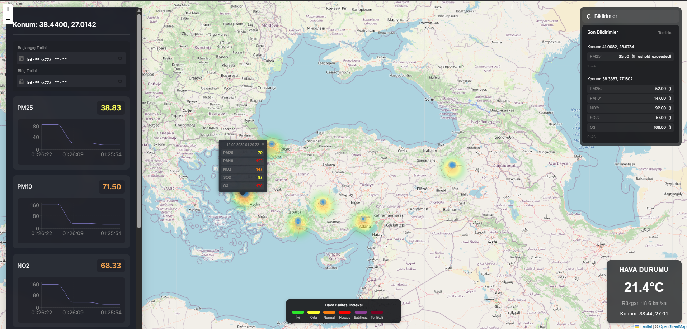

# Hava Kirliliği İzleme ve Analiz Sistemi (Monolitik Mimari)


## Proje Genel Bakış

Hava Kirliliği İzleme ve Analiz Sistemi, dünya genelindeki gerçek zamanlı hava kirliliği verilerini toplayan, işleyen, analiz eden ve kullanıcılara bildirim gönderen bir web tabanlı platformdur. Monolitik mimari yaklaşımıyla geliştirilmiş bu sistem, tüm işlevselliği tek bir uygulama içerisinde birleştirir.

### Proje Amaçları

- Kullanıcılardan gelen verilerin toplanması
- Veri akışının yönetilmesi
- Anomali tespiti yapılması
- Kullanıcılara web arayüzü üzerinden veri sağlama
- Gerçek zamanlı hava kalitesi bilgilendirmesi

## Özellikler


### Web Paneli Özellikleri
- Dinamik metrik seçimi
- Interaktif ısı haritası
- Otomatik veri güncelleme
- Detaylı anomali takibi
- Seçilen bölgeye özel Chartlı veri gösterimi
- Gerçek zamanlı hava kalitesi göstergeleri

### Bildirim Sistemi
- Anomali durumunda otomatik bilgilendirme

## Teknoloji Yığını

### Backend
- **Programlama Dili:** Python (Django)
- **Web Çatısı:** Django
- **ORM:**Django ORM
- **Anomali Tespiti:** Scikit-learn

### Frontend
- **Framework:** React
- **Harita Entegrasyonu:** Leaflet
- **Styling:** CSS

### Veritabanı
- **Ana Veritabanı:** PostgreSQL
- **Zaman Serisi Veritabanı:** TimescaleDB (PostgreSQL eklentisi)

### Diğer Teknolojiler
- **Haberleşme Protokolü:** SSE 
- **Konteynerizasyon:** Docker
- **Sunucu:** Nginx

## Mimari Yapı

### Monolitik Mimarinin Avantajları
- Basitleştirilmiş geliştirme süreci
- Daha az dağıtım karmaşıklığı
- Düşük gecikme süresi
- Daha kolay hata ayıklama

### Sistem Bileşenleri
1. **Veri Toplama Katmanı**
   - Sensör ve kullanıcı veri girişi
   - Veri doğrulama
   - Ham veri kaydetme

2. **Veri İşleme Katmanı**
   - Veri temizleme
   - Bölgesel ortalama hesaplama
   - Coğrafi kodlama

3. **Anomali Tespit Katmanı**
   - Zaman serisi anomali tespiti
   - Eşik bazlı anomali kontrolü
   - Mekansal anomali analizi

4. **Bildirim Katmanı**
   - Anomali bildirimleri
   - Anomali durumunda otomatik bildirim
   - Kullanıcı bilgilendirme
   - SSE ile veri girişi bilgilendirmesi

## Kurulum Rehberi

### Ön Koşullar
- Python 3.9+
- PostgreSQL 12+
- Docker

### Adım Adım Kurulum

#### 1. Depoyu Klonlama
```bash
git clone https://github.com/Tunarwn/Kartaca_AirQualityMeasurementApp.git
cd Kartaca_AirQualityMeasurementApp
```

#### 2. Bağımlılıkları Yükleme
```bash
pip install -r requirements.txt
```

#### 3. Veritabanı Kurulumu
```bash
# PostgreSQL ve TimescaleDB kurulumu
createdb hava_kalitesi_db
psql hava_kalitesi_db -c 'CREATE EXTENSION IF NOT EXISTS timescaledb;'

# Veritabanı geçişlerini uygulama
python manage.py migrate
```

#### Çevre Değişkenlerini Ayarlama
!!!Proje yalnızca local ortamda çalıştırılacağı için .env dosyası geçici olarak repoya dahil edilmiştir. Ancak, güvenlik ve gizlilik gereklilikleri nedeniyle .env dosyasının versiyon kontrol sistemine eklenmesi genellikle önerilmez.

`.env` dosyası:
```
DEBUG=True

POSTGRES_DB=airquality
POSTGRES_USER=airuser
POSTGRES_PASSWORD=airpass
POSTGRES_HOST=db
POSTGRES_PORT=5432
```


## API Dokümantasyonu

### Veri Toplama Endpoint'leri
- `POST /api/measurements`: Yeni ölçüm oluşturma
- `GET /api/measurements/history`: Ölçüm geçmişini görüntüleme
- `GET /api/measurements/by-location`:  Ölçümleri lokasyona göre görüntüleme

### Veri İşleme Endpoint'leri
- `GET /api/anomalies/list`: Anomali listesini görüntüleme
- `GET /api/anomalies/by-location`: Anomalileri lokasyona göre görüntüleme


### Bildirim Endpoint'leri
- `GET /api/anomalies/stream/`: Anomali bildirimlerini gösterme

## Test Senaryoları

### Manuel Test
```bash
python manual_input.py <enlem> <boylam> <parametre1> <değer1> <parametre2> <değer2> ... şeklinde dinamik veri girişi yapabilirsiniz.

Örneğin --> python manual_input.py 41.0082 28.9784 "pm25 35.5" "pm10 40" "no2 15" "so2 35" "o3 50"
```

### Otomatik Test
```bash
python auto_test.py [--duration SÜRE] [--rate HIZ] [--anomaly-chance YÜZDE]

Örneğin --> python auto_test.py --duration 120 --rate 3 --anomaly-chance 15
```

## Docker ile Dağıtım

### Docker Compose Kullanımı
```bash
docker-compose up --build
```

## İletişim

Proje sorumlusu: [Tunahan Turna]
E-posta: [tunahanturna17@gmail.com]
